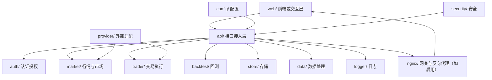
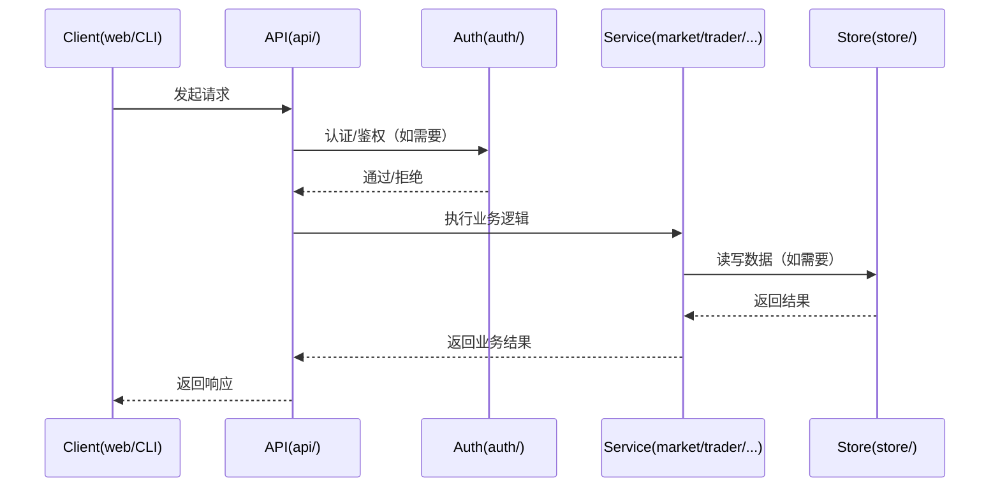

# 架构设计

本文件用于沉淀系统的总体架构、边界与关键决策索引（ADR）。
如与代码实现不一致，以代码为准并同步更新。

---

## 总体架构（概念图）

> 说明：该图为基于目录结构的概念级视图，用于快速理解系统边界；实际调用链与依赖以代码为准。

---

## 技术栈（基于仓库结构扫描）

- **核心/后端:** Go
- **前端/控制台:** TypeScript/JavaScript
- **脚本与运维:** Shell/PowerShell、Docker Compose、Nginx 配置
- **辅助:** Python（用于脚本/工具的可能性，具体以实际使用为准）

---

## 核心流程（示例：请求到业务处理）

> 说明：该时序为通用示意，便于后续在变更中补齐“真实路径”。

---

## 重大架构决策（ADR 索引）

> 完整 ADR 存储在各变更的 `how.md` 中，本章节仅提供索引。

| adr_id | title | date | status | affected_modules | details |
|--------|-------|------|--------|------------------|---------|

